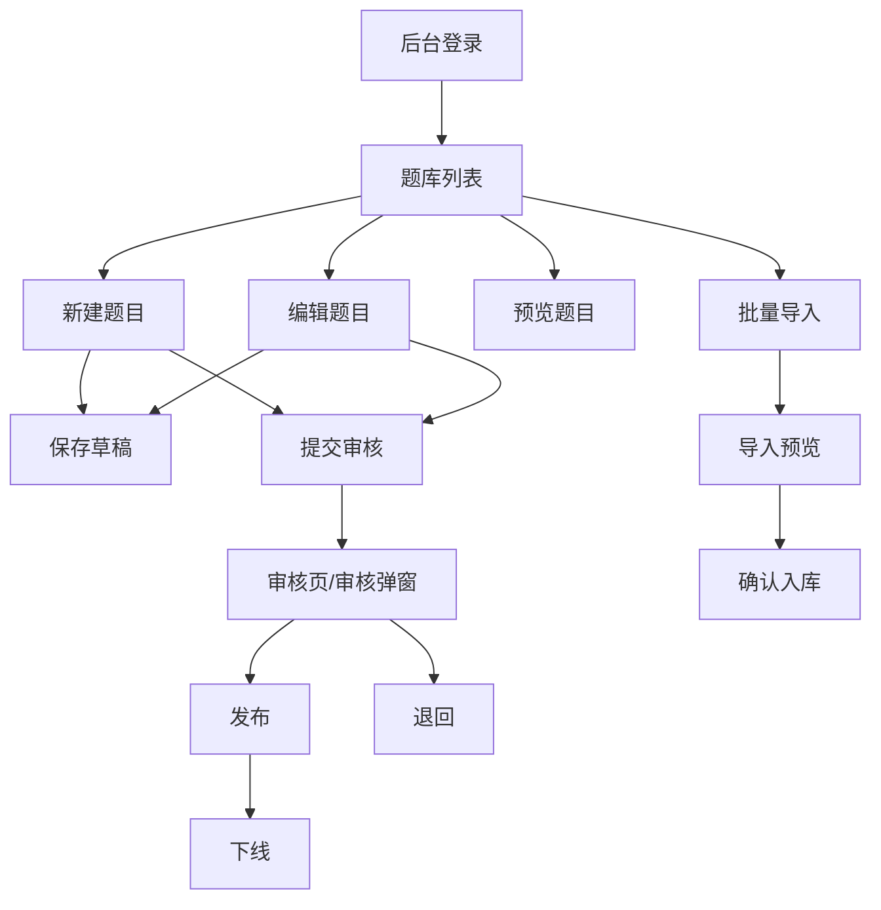

# Web 题目录入低代码系统设计

日期：2026-05-18

## 1. 背景与结论

本设计只覆盖 Web 后台端。当前阶段先建设“题库管理 + 题目录入 + 预览 + 审核发布 + 批量导入”的 Web 题目系统，不设计小程序端页面和小程序消费接口。

原型来源：

- Web 题库原型：`/data/project/ai-study/原型/stitch_web_english_exam_system (2).zip`
- 题库列表原型：压缩包内 `stitch_web_english_exam_system/_1`
- 题目录入原型：压缩包内 `stitch_web_english_exam_system/_2`
- Web 视觉规范：压缩包内 `stitch_web_english_exam_system/academic_utility/DESIGN.md`

工程路径：

- 用户提到的 `/data/project-sport-ui` 当前本机不存在。
- 低代码业务工程实际为 `/data/project/sport-ui`。
- 低代码组件库实际为 `/data/project/collect-ui`。
- AI Study Web 后台服务实际为 `/data/project/ai-study/backend`。

核心结论：

1. Web 后台沿用 AI Study 当前低代码后台：`POST /template_data/data?service=...`。
2. Web 页面配置从 `/data/project/sport-ui/data/question` 开发，部署到 `/data/project/ai-study/backend/frontend/data/question`。
3. 当前 mini build 入口 `/data/project/sport-ui/src/main.autocheck.tsx` 没有注册 `rich-text` 和 `rich-text-render`。题目录入需要富文本，应新增 AI Study 题库专用 Web build，不改现有 autocheck mini 包。
4. 数据库第一版采用结构化表为主：题目主表、选项表、答案表、知识点关系表、审核记录表、导入批次表、操作日志表。富文本 HTML 只放内容字段，检索字段单独保存纯文本。

## 2. Web 端范围

### 2.1 本期目标

- Web 登录后进入题库管理菜单。
- 题库列表支持筛选、搜索、分页、统计、预览、编辑、删除/下线。
- 题目录入支持选择题、判断题、填空题、简答题、计算题。
- 题干、选项、解析支持富文本录入和安全预览。
- 题目支持草稿、待审核、已发布、已下线、已退回状态。
- 审核发布记录可追溯。
- 批量导入先支持模板上传、解析预览、错误行展示、入库。
- 所有页面、接口、表结构可反复开发和验证。

### 2.2 本期不做

- 不做小程序页面。
- 不做小程序测评题目接口。
- 不做学生 Web 作答端。
- 不做复杂组卷算法。
- 不做主观题自动批改。
- 不做 AI 自动出题。
- 不在代码、文档、日志写入 SSH 密码或生产密钥。

## 3. 角色与流程

| 角色 | Web 权限 | 说明 |
| --- | --- | --- |
| 管理员 | 全部 | 用户、角色、菜单、码表、题库、审核、导入 |
| 教研/老师 | 题目维护 | 新建、编辑、预览、提交审核 |
| 审核员 | 审核发布 | 审核、发布、退回、下线 |

主流程：



## 4. Web 页面与功能字段

### 4.1 菜单设计

新增菜单建议写入 `sys_menu` 和 `role_menu` 种子数据。

| 菜单名称 | menu_code | URL | 前端服务 | 说明 |
| --- | --- | --- | --- | --- |
| 题库管理 | `question_bank` | `/framework/question-bank` | `frontend.question_bank` | 列表、筛选、统计、预览入口 |
| 题目录入 | `question_editor` | `/framework/question-editor` | `frontend.question_editor` | 新建和编辑复用 |
| 题目审核 | `question_review` | `/framework/question-review` | `frontend.question_review` | 待审核列表，可 M2 实现 |
| 批量导入 | `question_import` | `/framework/question-import` | `frontend.question_import` | 模板上传和导入批次 |

### 4.2 题库列表页

原型：`stitch_web_english_exam_system/_1`

路由：`/framework/question-bank`

低代码文件：

```text
/data/project/sport-ui/data/question/question_bank.json
/data/project/ai-study/backend/frontend/data/question/question_bank.json
```

筛选区字段：

| UI 字段 | store 字段 | 类型 | 数据来源 | 默认值 | 说明 |
| --- | --- | --- | --- | --- | --- |
| 关键词 | `searchForm.keyword` | input | 手输 | 空 | 匹配题干、编号、知识点 |
| 科目 | `searchForm.subject` | select | `sys_code.subject` | 空 | 全部科目 |
| 教材版本 | `searchForm.textbook_version` | select | `sys_code.textbook_version` | 空 | 人教版、北师大版等 |
| 学段 | `searchForm.stage` | select | `sys_code.study_stage` | 空 | 小学、初中、高中 |
| 年级 | `searchForm.grade` | select | `sys_code.grade` | 空 | 七年级等 |
| 单元 | `searchForm.unit_id` | select | `question.unit_query` | 空 | 跟随科目、年级联动 |
| 难度 | `searchForm.difficulty_list` | checkbox | `sys_code.question_difficulty` | 空数组 | 可多选 |
| 题型 | `searchForm.question_type` | select | `sys_code.question_type` | 空 | 选择题、填空题等 |
| 状态 | `searchForm.status` | select | `sys_code.question_status` | 空 | 草稿、待审核等 |
| 页码 | `searchForm.page` | number | 分页组件 | 1 | 查询参数 |
| 每页数量 | `searchForm.size` | number | 分页组件 | 20 | 查询参数 |

统计卡片字段：

| UI 文案 | store 字段 | 服务字段 | 说明 |
| --- | --- | --- | --- |
| 题库总数 | `stats.total_count` | `total_count` | 未删除题目总数 |
| 今日新增 | `stats.today_new_count` | `today_new_count` | 今日创建 |
| 待审核 | `stats.reviewing_count` | `reviewing_count` | status=reviewing |
| 已发布 | `stats.published_count` | `published_count` | status=published |

列表列字段：

| 列名 | 表字段 | 展示规则 |
| --- | --- | --- |
| 编号 | `question_item.question_code` | `#Q202605180001` |
| 题目预览 | `question_item.stem_text` | 单行省略，鼠标提示完整纯文本 |
| 科目 | `question_item.subject` | 码表翻译 |
| 年级 | `question_item.grade` | 码表翻译 |
| 单元 | `question_item.unit_name` | 冗余快照或关联查询 |
| 类型 | `question_item.question_type` | 码表翻译 + tag |
| 难度 | `question_item.difficulty` | basic/medium/hard |
| 状态 | `question_item.status` | draft/reviewing/published/offline/rejected |
| 更新日期 | `question_item.modify_time` | `YYYY-MM-DD HH:mm` |
| 操作 | - | 预览、编辑、提交审核、发布、下线、删除 |

页面动作：

| 动作 | 触发 | 服务 | 成功行为 |
| --- | --- | --- | --- |
| 查询 | 初始化、筛选、分页 | `question.question_query` | 更新 `dataList`、`count` |
| 统计 | 初始化、保存后刷新 | `question.question_stats` | 更新 `stats` |
| 新建 | 点击新建题目 | 前端路由 | 跳 `/framework/question-editor?mode=create` |
| 编辑 | 点击编辑 | 前端路由 | 跳 `/framework/question-editor?mode=edit&question_id=...` |
| 预览 | 点击预览 | `question.question_detail` | 打开预览弹窗 |
| 删除 | 点击删除 | `question.question_delete` | 软删除并刷新 |
| 提交审核 | 行动作 | `question.question_submit_review` | 状态变 `reviewing` |
| 发布 | 行动作 | `question.question_publish` | 状态变 `published` |
| 下线 | 行动作 | `question.question_offline` | 状态变 `offline` |

### 4.3 题目录入页

原型：`stitch_web_english_exam_system/_2`

路由：

```text
/framework/question-editor?mode=create
/framework/question-editor?mode=edit&question_id=...
```

低代码文件：

```text
/data/project/sport-ui/data/question/question_editor.json
/data/project/ai-study/backend/frontend/data/question/question_editor.json
```

元数据字段：

| UI 字段 | store 字段 | 表字段 | 控件 | 校验 |
| --- | --- | --- | --- | --- |
| 科目 | `questionForm.subject` | `question_item.subject` | select | 必填 |
| 学段 | `questionForm.stage` | `question_item.stage` | select | 必填 |
| 年级 | `questionForm.grade` | `question_item.grade` | select | 必填 |
| 教材版本 | `questionForm.textbook_version` | `question_item.textbook_version` | select | 必填 |
| 单元 | `questionForm.unit_id` | `question_item.unit_id` | select | 必填 |
| 题型 | `questionForm.question_type` | `question_item.question_type` | tabs | 必填 |
| 难度 | `questionForm.difficulty` | `question_item.difficulty` | segmented/radio | 必填 |
| 分值 | `questionForm.score` | `question_item.score` | number | 大于 0 |
| 建议时长 | `questionForm.duration_seconds` | `question_item.duration_seconds` | number | 可空 |
| 知识点 | `knowledgeList` | `question_knowledge_rel` | tag selector | 至少 1 个，发布时必填 |
| 试卷内序号 | `questionForm.sequence_no` | `question_item.sequence_no` | number | 可空 |
| 备注 | `questionForm.remark` | `question_item.remark` | textarea | 可空 |

题干字段：

| UI 字段 | store 字段 | 表字段 | 控件 | 校验 |
| --- | --- | --- | --- | --- |
| 题干富文本 | `questionForm.stem_html` | `question_item.stem_html` | `rich-text` | 必填 |
| 题干纯文本 | `questionForm.stem_text` | `question_item.stem_text` | 后端生成 | 保存时同步 |
| 题干资源 | `stemAssetList` | `question_asset` | upload/attachment | 可空 |

选项字段：

| UI 字段 | store 字段 | 表字段 | 控件 | 校验 |
| --- | --- | --- | --- | --- |
| 选项列表 | `optionList` | `question_option` | array form | 选择题至少 2 个 |
| 选项标识 | `optionList[].option_key` | `question_option.option_key` | input/tag | A/B/C/D |
| 选项排序 | `optionList[].option_order` | `question_option.option_order` | hidden | 从 1 开始 |
| 内容模式 | `optionList[].content_mode` | `question_option.content_mode` | switch | plain/rich |
| 选项 HTML | `optionList[].option_html` | `question_option.option_html` | input/rich-text | 必填 |
| 选项纯文本 | `optionList[].option_text` | `question_option.option_text` | 后端生成 | 保存时同步 |
| 是否正确 | `optionList[].is_correct` | `question_option.is_correct` | radio/checkbox | 按题型校验 |

答案字段：

| 题型 | store 字段 | 表字段 | 校验 |
| --- | --- | --- | --- |
| 单选题 | `answerForm.value=["A"]` | `question_answer.answer_value` | 必须且只能 1 个 |
| 多选题 | `answerForm.value=["A","C"]` | `question_answer.answer_value` | 至少 2 个 |
| 判断题 | `answerForm.value=["true"]` | `question_answer.answer_value` | true/false |
| 填空题 | `blankAnswerList` | `question_blank_answer` | 每空至少 1 个标准答案 |
| 简答题 | `answerForm.reference_text` | `question_answer.reference_text` | 发布时必填 |
| 计算题 | `scoringPointList` | `question_scoring_point` | 至少 1 个评分点 |

解析字段：

| UI 字段 | store 字段 | 表字段 | 控件 | 校验 |
| --- | --- | --- | --- | --- |
| 解析富文本 | `questionForm.analysis_html` | `question_item.analysis_html` | `rich-text` | 可空，发布建议必填 |
| 解析纯文本 | `questionForm.analysis_text` | `question_item.analysis_text` | 后端生成 | 保存时同步 |

底部动作：

| 按钮 | 服务 | 数据状态 |
| --- | --- | --- |
| 取消 | 前端路由 | 返回列表 |
| 预览题目 | `question.question_preview_data` 或本地 store | 打开预览弹窗 |
| 保存草稿 | `question.question_save` / `question.question_update` | status=draft |
| 保存并继续录入 | `question.question_save` | 保存成功后清空表单 |
| 提交审核 | `question.question_submit_review` | status=reviewing |

### 4.4 题目审核页

路由：`/framework/question-review`

低代码文件：

```text
/data/project/sport-ui/data/question/question_review.json
/data/project/ai-study/backend/frontend/data/question/question_review.json
```

字段：

| UI 字段 | store 字段 | 表字段/服务字段 | 说明 |
| --- | --- | --- | --- |
| 待审核列表 | `dataList` | `question_item.status=reviewing` | 表格 |
| 题目预览 | `previewData` | `question.question_detail` | 弹窗 |
| 审核意见 | `reviewForm.review_comment` | `question_review_record.review_comment` | 必填，退回时必须写 |
| 审核结果 | `reviewForm.review_result` | `question_review_record.review_result` | publish/reject |

动作：

| 动作 | 服务 | 说明 |
| --- | --- | --- |
| 通过并发布 | `question.question_publish` | 写 review record 和 change log |
| 退回修改 | `question.question_reject` | 状态变 rejected |
| 查看历史 | `question.question_review_history` | 展示审核记录 |

### 4.5 批量导入页

路由：`/framework/question-import`

低代码文件：

```text
/data/project/sport-ui/data/question/question_import.json
/data/project/ai-study/backend/frontend/data/question/question_import.json
```

字段：

| UI 字段 | store 字段 | 表字段 | 说明 |
| --- | --- | --- | --- |
| 上传文件 | `importForm.file` | `question_import_batch.file_name` | Excel/JSON |
| 科目 | `importForm.subject` | `question_import_batch.subject` | 导入默认科目 |
| 教材版本 | `importForm.textbook_version` | `question_import_batch.textbook_version` | 导入默认教材 |
| 解析结果 | `previewRows` | `question_import_row` | 行级预览 |
| 错误数量 | `batch.fail_count` | `question_import_batch.fail_count` | 校验错误 |
| 成功数量 | `batch.success_count` | `question_import_batch.success_count` | 可入库数量 |

动作：

| 动作 | 服务 | 说明 |
| --- | --- | --- |
| 下载模板 | 静态文件 | `frontend/data/template/question-import-template.xlsx` |
| 上传解析 | `question.import_parse` | 只解析，不入库 |
| 确认入库 | `question.import_commit` | 写入题目表 |
| 查看批次 | `question.import_batch_query` | 历史批次列表 |

## 5. 功能表字段设计

### 5.1 通用字段规范

所有业务表统一使用以下约定：

- 主键使用 `text`，由后端 `uuid` 生成。
- 时间字段使用 `text`，格式 `YYYY-MM-DD HH:mm:ss`。
- 软删除字段统一为 `is_delete`，`0` 表示未删除，`1` 表示已删除。
- 创建和修改字段统一为 `create_time`、`create_user`、`modify_time`、`modify_user`。
- 状态字段使用码表值，不写中文。
- 富文本字段保存 HTML，配套纯文本字段用于列表和搜索。

### 5.2 `question_item` 题目主表

用途：保存题目的核心元数据、题干、解析、状态和版本。

| 字段 | 类型 | 必填 | 默认值 | 说明 |
| --- | --- | --- | --- | --- |
| `question_id` | text | 是 | uuid | 主键 |
| `question_code` | text | 是 | 生成 | 展示编号，如 Q202605180001 |
| `title` | text | 否 | 空 | 内部标题，可用题干摘要生成 |
| `subject` | text | 是 | 空 | 科目码表：english/math/chinese 等 |
| `stage` | text | 是 | 空 | 学段码表：primary/junior/senior |
| `grade` | text | 是 | 空 | 年级码表：grade_7 等 |
| `textbook_version` | text | 是 | 空 | 教材版本码表 |
| `unit_id` | text | 是 | 空 | 关联 `question_unit.unit_id` |
| `unit_code` | text | 否 | 空 | 单元编码快照 |
| `unit_name` | text | 否 | 空 | 单元名称快照 |
| `question_type` | text | 是 | single_choice | single_choice/multiple_choice/judge/blank/short_answer/calculation |
| `difficulty` | text | 是 | basic | basic/medium/hard |
| `score` | integer | 是 | 5 | 默认分值 |
| `duration_seconds` | integer | 否 | 0 | 建议作答时长 |
| `sequence_no` | integer | 否 | 0 | 试卷内序号或录入顺序 |
| `stem_html` | text | 是 | 空 | 题干 HTML |
| `stem_text` | text | 是 | 空 | 题干纯文本 |
| `analysis_html` | text | 否 | 空 | 解析 HTML |
| `analysis_text` | text | 否 | 空 | 解析纯文本 |
| `option_count` | integer | 否 | 0 | 选项数量缓存 |
| `blank_count` | integer | 否 | 0 | 填空数量缓存 |
| `asset_count` | integer | 否 | 0 | 资源数量缓存 |
| `content_hash` | text | 否 | 空 | 内容哈希，用于重复题检测 |
| `source` | text | 是 | manual | manual/import |
| `status` | text | 是 | draft | draft/reviewing/published/offline/rejected |
| `version` | integer | 是 | 1 | 版本号 |
| `publish_time` | text | 否 | 空 | 发布时间 |
| `publish_user` | text | 否 | 空 | 发布人 |
| `last_review_id` | text | 否 | 空 | 最近审核记录 |
| `remark` | text | 否 | 空 | 备注 |
| `is_delete` | text | 是 | 0 | 软删除 |
| `create_time` | text | 是 | 当前时间 | 创建时间 |
| `create_user` | text | 是 | session user_id | 创建人 |
| `modify_time` | text | 是 | 当前时间 | 修改时间 |
| `modify_user` | text | 是 | session user_id | 修改人 |

建议索引：

```sql
create index idx_question_item_query
on question_item(subject, grade, unit_id, question_type, difficulty, status, is_delete);

create index idx_question_item_modify_time
on question_item(modify_time);

create index idx_question_item_code
on question_item(question_code);
```

### 5.3 `question_option` 题目选项表

用途：选择题和判断题的选项。判断题可固定为 true/false 两行，也可只写答案表。

| 字段 | 类型 | 必填 | 默认值 | 说明 |
| --- | --- | --- | --- | --- |
| `option_id` | text | 是 | uuid | 主键 |
| `question_id` | text | 是 | 空 | 关联题目 |
| `option_key` | text | 是 | 空 | A/B/C/D/true/false |
| `option_order` | integer | 是 | 1 | 排序 |
| `content_mode` | text | 是 | plain | plain/rich |
| `option_html` | text | 是 | 空 | 选项 HTML |
| `option_text` | text | 是 | 空 | 选项纯文本 |
| `is_correct` | text | 是 | 0 | 是否正确，0/1 |
| `asset_count` | integer | 否 | 0 | 选项资源数 |
| `is_delete` | text | 是 | 0 | 软删除 |
| `create_time` | text | 是 | 当前时间 | 创建时间 |
| `create_user` | text | 是 | session user_id | 创建人 |
| `modify_time` | text | 是 | 当前时间 | 修改时间 |
| `modify_user` | text | 是 | session user_id | 修改人 |

建议索引：

```sql
create index idx_question_option_question
on question_option(question_id, option_order, is_delete);
```

### 5.4 `question_answer` 标准答案表

用途：保存统一答案结构。选择、判断、主观题均写一条；填空题同时写 `question_blank_answer`。

| 字段 | 类型 | 必填 | 默认值 | 说明 |
| --- | --- | --- | --- | --- |
| `answer_id` | text | 是 | uuid | 主键 |
| `question_id` | text | 是 | 空 | 关联题目 |
| `answer_type` | text | 是 | 空 | 同 `question_type` |
| `answer_value` | text | 是 | 空 | JSON，如 `["A"]`、`["A","C"]`、`["true"]` |
| `answer_text` | text | 否 | 空 | 人类可读答案 |
| `reference_text` | text | 否 | 空 | 简答/计算参考答案 |
| `case_sensitive` | text | 是 | 0 | 填空是否大小写敏感 |
| `allow_order_change` | text | 是 | 0 | 多答案是否允许顺序变化 |
| `auto_grading_rule` | text | 否 | 空 | JSON，预留自动判分规则 |
| `is_delete` | text | 是 | 0 | 软删除 |
| `create_time` | text | 是 | 当前时间 | 创建时间 |
| `create_user` | text | 是 | session user_id | 创建人 |
| `modify_time` | text | 是 | 当前时间 | 修改时间 |
| `modify_user` | text | 是 | session user_id | 修改人 |

### 5.5 `question_blank_answer` 填空答案表

用途：填空题每个空位的答案配置。

| 字段 | 类型 | 必填 | 默认值 | 说明 |
| --- | --- | --- | --- | --- |
| `blank_answer_id` | text | 是 | uuid | 主键 |
| `question_id` | text | 是 | 空 | 关联题目 |
| `blank_index` | integer | 是 | 1 | 第几个空 |
| `standard_answer` | text | 是 | 空 | 标准答案 |
| `alternative_answers` | text | 否 | `[]` | JSON 数组，备选答案 |
| `score` | integer | 否 | 0 | 本空分值 |
| `match_mode` | text | 是 | exact | exact/contains/regex |
| `case_sensitive` | text | 是 | 0 | 大小写敏感 |
| `is_delete` | text | 是 | 0 | 软删除 |
| `create_time` | text | 是 | 当前时间 | 创建时间 |
| `create_user` | text | 是 | session user_id | 创建人 |
| `modify_time` | text | 是 | 当前时间 | 修改时间 |
| `modify_user` | text | 是 | session user_id | 修改人 |

### 5.6 `question_scoring_point` 主观题评分点表

用途：简答题、计算题评分点。

| 字段 | 类型 | 必填 | 默认值 | 说明 |
| --- | --- | --- | --- | --- |
| `scoring_point_id` | text | 是 | uuid | 主键 |
| `question_id` | text | 是 | 空 | 关联题目 |
| `point_index` | integer | 是 | 1 | 评分点序号 |
| `point_text` | text | 是 | 空 | 评分点说明 |
| `score` | integer | 是 | 0 | 本评分点分值 |
| `keywords` | text | 否 | `[]` | JSON 数组，关键词 |
| `is_required` | text | 是 | 0 | 是否必要得分点 |
| `is_delete` | text | 是 | 0 | 软删除 |
| `create_time` | text | 是 | 当前时间 | 创建时间 |
| `create_user` | text | 是 | session user_id | 创建人 |
| `modify_time` | text | 是 | 当前时间 | 修改时间 |
| `modify_user` | text | 是 | session user_id | 修改人 |

### 5.7 `question_unit` 教材单元表

用途：维护科目、教材、年级、单元层级，供录入和筛选使用。

| 字段 | 类型 | 必填 | 默认值 | 说明 |
| --- | --- | --- | --- | --- |
| `unit_id` | text | 是 | uuid | 主键 |
| `subject` | text | 是 | 空 | 科目 |
| `stage` | text | 是 | 空 | 学段 |
| `grade` | text | 是 | 空 | 年级 |
| `textbook_version` | text | 是 | 空 | 教材版本 |
| `parent_id` | text | 否 | 空 | 父级章节 |
| `unit_code` | text | 是 | 空 | 单元编码 |
| `unit_name` | text | 是 | 空 | 单元名称 |
| `order_index` | integer | 是 | 1 | 排序 |
| `status` | text | 是 | enabled | enabled/disabled |
| `is_delete` | text | 是 | 0 | 软删除 |
| `create_time` | text | 是 | 当前时间 | 创建时间 |
| `create_user` | text | 是 | session user_id | 创建人 |
| `modify_time` | text | 是 | 当前时间 | 修改时间 |
| `modify_user` | text | 是 | session user_id | 修改人 |

### 5.8 `question_knowledge` 知识点表

用途：维护知识点树。

| 字段 | 类型 | 必填 | 默认值 | 说明 |
| --- | --- | --- | --- | --- |
| `knowledge_id` | text | 是 | uuid | 主键 |
| `subject` | text | 是 | 空 | 科目 |
| `stage` | text | 否 | 空 | 学段 |
| `grade` | text | 否 | 空 | 年级 |
| `parent_id` | text | 否 | 空 | 父知识点 |
| `knowledge_code` | text | 是 | 空 | 知识点编码 |
| `knowledge_name` | text | 是 | 空 | 知识点名称 |
| `order_index` | integer | 是 | 1 | 排序 |
| `status` | text | 是 | enabled | enabled/disabled |
| `is_delete` | text | 是 | 0 | 软删除 |
| `create_time` | text | 是 | 当前时间 | 创建时间 |
| `create_user` | text | 是 | session user_id | 创建人 |
| `modify_time` | text | 是 | 当前时间 | 修改时间 |
| `modify_user` | text | 是 | session user_id | 修改人 |

### 5.9 `question_knowledge_rel` 题目知识点关系表

用途：题目和知识点多对多关系。

| 字段 | 类型 | 必填 | 默认值 | 说明 |
| --- | --- | --- | --- | --- |
| `rel_id` | text | 是 | uuid | 主键 |
| `question_id` | text | 是 | 空 | 题目 ID |
| `knowledge_id` | text | 是 | 空 | 知识点 ID |
| `knowledge_name` | text | 否 | 空 | 知识点名称快照 |
| `order_index` | integer | 是 | 1 | 排序 |
| `create_time` | text | 是 | 当前时间 | 创建时间 |
| `create_user` | text | 是 | session user_id | 创建人 |

### 5.10 `question_asset` 题目资源表

用途：记录题干、选项、解析中引用的图片、音频等 Web 资源。Web 端可以先只保存 URL，不把文件放进前端源码目录。

| 字段 | 类型 | 必填 | 默认值 | 说明 |
| --- | --- | --- | --- | --- |
| `asset_id` | text | 是 | uuid | 主键 |
| `question_id` | text | 是 | 空 | 题目 ID |
| `usage_type` | text | 是 | stem | stem/option/analysis |
| `usage_ref` | text | 否 | 空 | 选项 key 或空位编号 |
| `asset_url` | text | 是 | 空 | 资源 URL |
| `asset_name` | text | 否 | 空 | 文件名 |
| `mime_type` | text | 否 | 空 | MIME 类型 |
| `file_size` | integer | 否 | 0 | 字节数 |
| `sha256` | text | 否 | 空 | 文件 hash |
| `status` | text | 是 | enabled | enabled/disabled |
| `is_delete` | text | 是 | 0 | 软删除 |
| `create_time` | text | 是 | 当前时间 | 创建时间 |
| `create_user` | text | 是 | session user_id | 创建人 |

### 5.11 `question_review_record` 审核记录表

用途：记录每次审核、发布、退回、下线。

| 字段 | 类型 | 必填 | 默认值 | 说明 |
| --- | --- | --- | --- | --- |
| `review_id` | text | 是 | uuid | 主键 |
| `question_id` | text | 是 | 空 | 题目 ID |
| `from_status` | text | 是 | 空 | 操作前状态 |
| `to_status` | text | 是 | 空 | 操作后状态 |
| `review_result` | text | 是 | 空 | submit/publish/reject/offline |
| `review_comment` | text | 否 | 空 | 审核意见 |
| `review_user` | text | 是 | session user_id | 审核人 |
| `review_time` | text | 是 | 当前时间 | 审核时间 |
| `is_delete` | text | 是 | 0 | 软删除 |

### 5.12 `question_change_log` 操作日志表

用途：记录关键字段变更，便于追溯。

| 字段 | 类型 | 必填 | 默认值 | 说明 |
| --- | --- | --- | --- | --- |
| `log_id` | text | 是 | uuid | 主键 |
| `question_id` | text | 是 | 空 | 题目 ID |
| `op_type` | text | 是 | 空 | create/update/delete/submit_review/publish/reject/offline |
| `before_json` | text | 否 | `{}` | 修改前快照 |
| `after_json` | text | 否 | `{}` | 修改后快照 |
| `op_user` | text | 是 | session user_id | 操作人 |
| `op_time` | text | 是 | 当前时间 | 操作时间 |
| `remark` | text | 否 | 空 | 备注 |

### 5.13 `question_import_batch` 导入批次表

用途：记录一次上传解析和入库过程。

| 字段 | 类型 | 必填 | 默认值 | 说明 |
| --- | --- | --- | --- | --- |
| `batch_id` | text | 是 | uuid | 主键 |
| `file_name` | text | 是 | 空 | 原文件名 |
| `file_url` | text | 否 | 空 | 上传文件 URL |
| `subject` | text | 否 | 空 | 导入默认科目 |
| `stage` | text | 否 | 空 | 导入默认学段 |
| `grade` | text | 否 | 空 | 导入默认年级 |
| `textbook_version` | text | 否 | 空 | 导入默认教材 |
| `status` | text | 是 | parsing | parsing/validated/committed/failed |
| `total_count` | integer | 是 | 0 | 总行数 |
| `success_count` | integer | 是 | 0 | 成功数 |
| `fail_count` | integer | 是 | 0 | 失败数 |
| `error_summary` | text | 否 | 空 | 错误摘要 |
| `create_time` | text | 是 | 当前时间 | 创建时间 |
| `create_user` | text | 是 | session user_id | 创建人 |
| `modify_time` | text | 是 | 当前时间 | 修改时间 |
| `modify_user` | text | 是 | session user_id | 修改人 |

### 5.14 `question_import_row` 导入行表

用途：保存每一行解析结果、错误信息和最终写入的题目 ID。

| 字段 | 类型 | 必填 | 默认值 | 说明 |
| --- | --- | --- | --- | --- |
| `row_id` | text | 是 | uuid | 主键 |
| `batch_id` | text | 是 | 空 | 导入批次 |
| `row_index` | integer | 是 | 1 | Excel 行号 |
| `raw_json` | text | 是 | `{}` | 原始行 JSON |
| `parsed_json` | text | 否 | `{}` | 解析后的题目 JSON |
| `validate_status` | text | 是 | pending | pending/success/failed |
| `error_msg` | text | 否 | 空 | 行级错误 |
| `question_id` | text | 否 | 空 | 入库后的题目 ID |
| `create_time` | text | 是 | 当前时间 | 创建时间 |
| `create_user` | text | 是 | session user_id | 创建人 |

## 6. 码表字段

使用现有 `sys_code` 表维护。建议初始化以下 `sys_code_type`。

| 码表类型 | sys_code_type | code 示例 | text 示例 |
| --- | --- | --- | --- |
| 科目 | `subject` | `english` | 英语 |
| 学段 | `study_stage` | `junior` | 初中 |
| 年级 | `grade` | `grade_7` | 七年级 |
| 教材版本 | `textbook_version` | `pep` | 人教版 |
| 题型 | `question_type` | `single_choice` | 单选题 |
| 难度 | `question_difficulty` | `basic` | 基础 |
| 题目状态 | `question_status` | `draft` | 草稿 |
| 内容模式 | `content_mode` | `rich` | 富文本 |
| 审核结果 | `review_result` | `publish` | 发布 |
| 导入状态 | `import_status` | `validated` | 已校验 |

题目状态流转：

```text
draft -> reviewing -> published
draft -> reviewing -> rejected -> draft
published -> offline
draft/rejected/offline -> delete
```

## 7. 后端低代码服务

新增服务域：

```text
/data/project/ai-study/backend/collect/question/service.yml
/data/project/ai-study/backend/collect/question/question/index.yml
/data/project/ai-study/backend/collect/question/unit/index.yml
/data/project/ai-study/backend/collect/question/knowledge/index.yml
/data/project/ai-study/backend/collect/question/import/index.yml
```

在 `/data/project/ai-study/backend/collect/service_router.yml` 注册：

```yaml
services:
  - key: question
    name: 题库
    path: question/service.yml
```

### 7.1 题目服务

| 服务 | 入参 | 出参 | 表 |
| --- | --- | --- | --- |
| `question.question_query` | `keyword, subject, stage, grade, textbook_version, unit_id, question_type, difficulty_list, status, page, size` | `data, count` | `question_item` |
| `question.question_stats` | `subject, grade, status` | `total_count, today_new_count, reviewing_count, published_count` | `question_item` |
| `question.question_detail` | `question_id` | `question, option_list, answer, blank_answer_list, scoring_point_list, knowledge_list, asset_list` | 多表 |
| `question.question_save` | 完整表单 | `question_id` | 多表 |
| `question.question_update` | `question_id` + 完整表单 | `question_id` | 多表 |
| `question.question_delete` | `question_id` | `success` | `question_item` |
| `question.question_submit_review` | `question_id` | `status` | `question_item`, `question_review_record` |
| `question.question_publish` | `question_id, review_comment` | `status` | `question_item`, `question_review_record` |
| `question.question_reject` | `question_id, review_comment` | `status` | `question_item`, `question_review_record` |
| `question.question_offline` | `question_id, review_comment` | `status` | `question_item`, `question_review_record` |
| `question.question_review_history` | `question_id` | `data` | `question_review_record` |

保存服务的后端校验：

- `subject`、`stage`、`grade`、`textbook_version`、`unit_id` 必填。
- `question_type` 必须在码表中存在。
- `stem_html` 清洗后不能为空。
- 单选题必须且只能有一个正确选项。
- 多选题至少两个正确选项。
- 判断题答案只能是 true 或 false。
- 填空题每个空位至少一个标准答案。
- 简答题发布时必须有参考答案。
- 计算题发布时必须有评分点。
- 发布时至少绑定一个知识点。

### 7.2 单元和知识点服务

| 服务 | 入参 | 出参 | 表 |
| --- | --- | --- | --- |
| `question.unit_query` | `subject, stage, grade, textbook_version, status` | `data` | `question_unit` |
| `question.unit_save` | 单元表单 | `unit_id` | `question_unit` |
| `question.unit_update` | `unit_id` + 表单 | `unit_id` | `question_unit` |
| `question.knowledge_query` | `subject, stage, grade, keyword` | `data` | `question_knowledge` |
| `question.knowledge_save` | 知识点表单 | `knowledge_id` | `question_knowledge` |
| `question.knowledge_update` | `knowledge_id` + 表单 | `knowledge_id` | `question_knowledge` |

### 7.3 导入服务

| 服务 | 入参 | 出参 | 表 |
| --- | --- | --- | --- |
| `question.import_parse` | `file, subject, stage, grade, textbook_version` | `batch_id, total_count, success_count, fail_count, rows` | `question_import_batch`, `question_import_row` |
| `question.import_commit` | `batch_id` | `success_count, fail_count` | 导入表 + 题目表 |
| `question.import_batch_query` | `page, size, status` | `data, count` | `question_import_batch` |
| `question.import_row_query` | `batch_id, page, size` | `data, count` | `question_import_row` |

## 8. 低代码前端集成

### 8.1 页面数据文件

开发源文件：

```text
/data/project/sport-ui/data/question/question_bank.json
/data/project/sport-ui/data/question/question_editor.json
/data/project/sport-ui/data/question/question_review.json
/data/project/sport-ui/data/question/question_import.json
```

部署目标：

```text
/data/project/ai-study/backend/frontend/data/question/question_bank.json
/data/project/ai-study/backend/frontend/data/question/question_editor.json
/data/project/ai-study/backend/frontend/data/question/question_review.json
/data/project/ai-study/backend/frontend/data/question/question_import.json
```

前端服务配置示例：

```yaml
- key: question_bank
  http: true
  module: empty
  handler_params:
    - key: file2datajson
      save_field: data
    - key: param2result
      field: data
  data_file: data/question/question_bank.json
```

### 8.2 富文本专用 Web build

新增文件：

```text
/data/project/sport-ui/src/main.ai-study-question.tsx
/data/project/sport-ui/index-ai-study-question.html
/data/project/sport-ui/vite.config.ai-study-question.min.js
```

入口注册范围：

- `Render`
- `rich-text`
- `rich-text-render`
- `attachment`
- `attachment-show`
- `copy-text`

新增脚本：

```json
{
  "build:ai-study-question:min": "NODE_OPTIONS=--max_old_space_size=8192 vite build --config vite.config.ai-study-question.min.js"
}
```

打包要求：

- `base` 为 `/collect-ui/`。
- 输出目录为 `build-ai-study-question`。
- 生成 gzip。
- 不引入 WebShell、Monaco、office 预览、播放器等无关模块。
- `react-quill` 和 `dompurify` 独立 chunk，便于后续排查富文本问题。

### 8.3 富文本安全

- 保存前后端均生成纯文本字段。
- 展示时使用 `rich-text-render`，内部必须走 `DOMPurify.sanitize`。
- 表格只展示 `stem_text`，不直接渲染 HTML。
- HTML 中 `<script>`、事件属性、危险 URL 必须过滤。
- 资源只保存 URL 和 metadata，不把上传文件写进前端源码目录。

## 9. 开发里程碑

### M0 设计与基线

交付：

- 本设计文档。
- 明确 Web only 范围。
- 明确低代码工程路径和富文本 build 风险。

验收：

- 文档可作为表结构、服务、页面开发依据。

### M1 表结构与后端服务

任务：

- 新增 `question_item`、`question_option`、`question_answer`、`question_blank_answer`、`question_scoring_point`。
- 新增 `question_unit`、`question_knowledge`、`question_knowledge_rel`。
- 新增 `question_asset`、`question_review_record`、`question_change_log`。
- 新增 `question_import_batch`、`question_import_row`。
- 注册 Go model。
- 注册 `collect/question` 服务。
- 初始化码表和菜单。

验收：

```bash
cd /data/project/ai-study/backend
go test ./...
go build ./...
sqlite3 database/ai_study_admin.db ".tables"
```

### M2 题库列表页

任务：

- 实现 `question_bank.json`。
- 接入 `question.question_query` 和 `question.question_stats`。
- 接入预览、编辑、删除、提交审核、发布、下线按钮。

验收：

- 登录后可从菜单进入题库管理。
- 筛选、搜索、分页请求参数正确。
- 表格字段与本设计一致。
- 空数据、加载失败、加载中状态可见。

### M3 题目录入页与富文本 build

任务：

- 新增 AI Study 题库专用 Web build。
- 实现 `question_editor.json`。
- 支持完整题目表单、选项、答案、知识点、预览、保存草稿、提交审核。

验收：

```bash
cd /data/project/sport-ui
npm run build:ai-study-question:min
find build-ai-study-question -type f -name '*.gz' | sort | head
find data/question -name '*.json' -print0 | xargs -0 -n1 python3 -m json.tool >/dev/null
```

浏览器验收：

- `/collect-ui/#/framework/question-editor?mode=create` 可打开。
- 富文本编辑器可输入题干、选项、解析。
- 切换题型时答案区按规则变化。
- 保存后列表可看到新题。
- 预览弹窗渲染 HTML 且无 console error。

### M4 审核与导入

任务：

- 实现 `question_review.json`。
- 实现 `question_import.json`。
- 实现审核发布、退回、下线。
- 实现导入解析、预览、确认入库。

验收：

- 题目状态流转符合本设计。
- 审核记录和操作日志写入。
- 导入错误行可定位。
- 导入成功后题库列表可检索。

### M5 Web 稳定验收

任务：

- 增加 Playwright 回归脚本。
- 验证登录、列表、录入、预览、审核、导入。
- 生成截图和接口证据。

验收：

- 后端 `go test ./...`、`go build ./...` 通过。
- 前端 build 通过并有 gzip。
- 低代码 JSON 全部通过格式校验。
- 浏览器无 `console error` 和 `pageerror`。

## 10. 可反复执行流程

每轮使用 Run ID：

```text
YYYYMMDD-HHMM-web-question-Mx
```

开发前：

```bash
cd /data/project/ai-study
find 原型 -maxdepth 2 -type f | sort
find feature -maxdepth 2 -type f | sort
```

后端检查：

```bash
cd /data/project/ai-study/backend
go test ./...
go build ./...
```

低代码检查：

```bash
cd /data/project/sport-ui
find data/question -name '*.json' -print0 | xargs -0 -n1 python3 -m json.tool >/dev/null
npm run build:ai-study-question:min
```

接口检查：

```bash
curl -i -c /tmp/ai-study-admin.cookie -H 'Content-Type: application/json' \
  -X POST 'http://127.0.0.1:8026/template_data/data?service=system.login' \
  -d '{"username":"admin","password":"123456"}'

curl -s -b /tmp/ai-study-admin.cookie -H 'Content-Type: application/json' \
  -X POST 'http://127.0.0.1:8026/template_data/data?service=question.question_query' \
  -d '{"page":1,"size":20}'
```

浏览器检查：

- 登录页能打开。
- 题库列表能打开。
- 新建题目页能打开。
- 富文本编辑器出现并可输入。
- 保存后数据出现在列表。
- 预览弹窗无 console error 和 pageerror。

证据目录：

```text
feature/evidence/web-question-entry/<run-id>/
```

## 11. 低代码页面 store 骨架

### 11.1 `question_bank.json`

```json
{
  "tag": "layout-fit",
  "storeName": "questionBank",
  "initStore": {
    "searchForm": {
      "page": 1,
      "size": 20,
      "keyword": "",
      "subject": "",
      "stage": "",
      "grade": "",
      "textbook_version": "",
      "unit_id": "",
      "difficulty_list": [],
      "question_type": "",
      "status": ""
    },
    "dataList": [],
    "count": 0,
    "stats": {},
    "previewVisible": false,
    "previewData": {}
  }
}
```

### 11.2 `question_editor.json`

```json
{
  "tag": "layout-fit",
  "storeName": "questionEditor",
  "initStore": {
    "mode": "create",
    "question_id": "",
    "questionForm": {
      "subject": "english",
      "stage": "junior",
      "grade": "",
      "textbook_version": "",
      "unit_id": "",
      "question_type": "single_choice",
      "difficulty": "basic",
      "score": 5,
      "duration_seconds": 0,
      "sequence_no": 0,
      "stem_html": "",
      "analysis_html": "",
      "remark": "",
      "status": "draft"
    },
    "optionList": [
      { "option_key": "A", "option_order": 1, "content_mode": "plain", "option_html": "", "is_correct": "1" },
      { "option_key": "B", "option_order": 2, "content_mode": "plain", "option_html": "", "is_correct": "0" },
      { "option_key": "C", "option_order": 3, "content_mode": "plain", "option_html": "", "is_correct": "0" },
      { "option_key": "D", "option_order": 4, "content_mode": "plain", "option_html": "", "is_correct": "0" }
    ],
    "answerForm": {
      "answer_type": "single_choice",
      "answer_value": ["A"],
      "reference_text": "",
      "case_sensitive": "0",
      "allow_order_change": "0"
    },
    "blankAnswerList": [],
    "scoringPointList": [],
    "knowledgeList": [],
    "assetList": [],
    "previewVisible": false
  }
}
```

## 12. 验收标准

单页面验收：

- 页面可从菜单或 URL 进入。
- 首屏布局贴近 Web 原型，核心内容不空白。
- 所有按钮有明确行为：跳转、请求、弹窗、状态变化或提示。
- 请求失败有提示。
- 富文本不破坏页面布局。
- 表单校验能阻止无效数据提交。

全量验收：

- 题库列表、题目录入、审核、导入四个 Web 页面可用。
- 可完成“新建题目 - 保存草稿 - 列表查看 - 编辑 - 预览 - 提交审核 - 发布”闭环。
- 富文本 build 可重复构建并包含 gzip。
- 后端 `go test ./...` 和 `go build ./...` 通过。
- 低代码 JSON 通过 `python3 -m json.tool`。
- 登录、题库查询、详情、保存、审核、导入接口可用。

## 13. 风险与处理

| 风险 | 处理 |
| --- | --- |
| 富文本进入现有 mini 包导致体积和回归风险 | 独立 `ai-study-question` Web build |
| HTML 带来 XSS 风险 | 展示统一 `DOMPurify.sanitize`，后端保存同步纯文本 |
| 题型字段复杂 | 题目主表 + 选项/答案/填空/评分点子表 |
| 表格渲染富文本过重 | 列表只展示 `stem_text` |
| 发布后题目被直接覆盖 | 使用 `status + version + review_record + change_log` |
| 导入错误难定位 | 使用 `question_import_row` 保存行级错误 |
| 后台静态目录不一致 | 部署脚本同步 `frontend/data/question` 和 `frontend/collect-ui` |

## 14. 执行日志模板

```text
Run ID:
日期:
范围:
原型:
修改文件:
新增表:
后端服务:
低代码页面:
构建命令:
接口验证:
浏览器验证:
截图证据:
验收结论:
遗留问题:
下一轮建议:
```

## 15. 当前记录

Run ID: `20260518-design-web-question-lowcode-v2`

已确认：

- 本版文档收敛为 Web 端，不设计小程序端。
- Web 题库原型包含 `_1` 列表页、`_2` 录入页和 `academic_utility/DESIGN.md`。
- `/data/project-sport-ui` 不存在，实际低代码工程为 `/data/project/sport-ui`。
- `/data/project/sport-ui/src/main.autocheck.tsx` 没有注册 `rich-text` 和 `rich-text-render`。
- `/data/project/sport-ui/src/main.tsx` 已有 `rich-text`、`rich-text-render` 注册，可作为专用入口参考。
- `/data/project/ai-study/backend` 已具备低代码后台基础：登录、用户、角色、菜单、码表、页面配置和静态前端目录。

下一轮建议：

1. 先按第 5 节落表结构和 model 注册。
2. 再按第 7 节实现题目保存、查询、详情服务。
3. 最后做富文本专用 Web build 和 `question_editor.json`。
