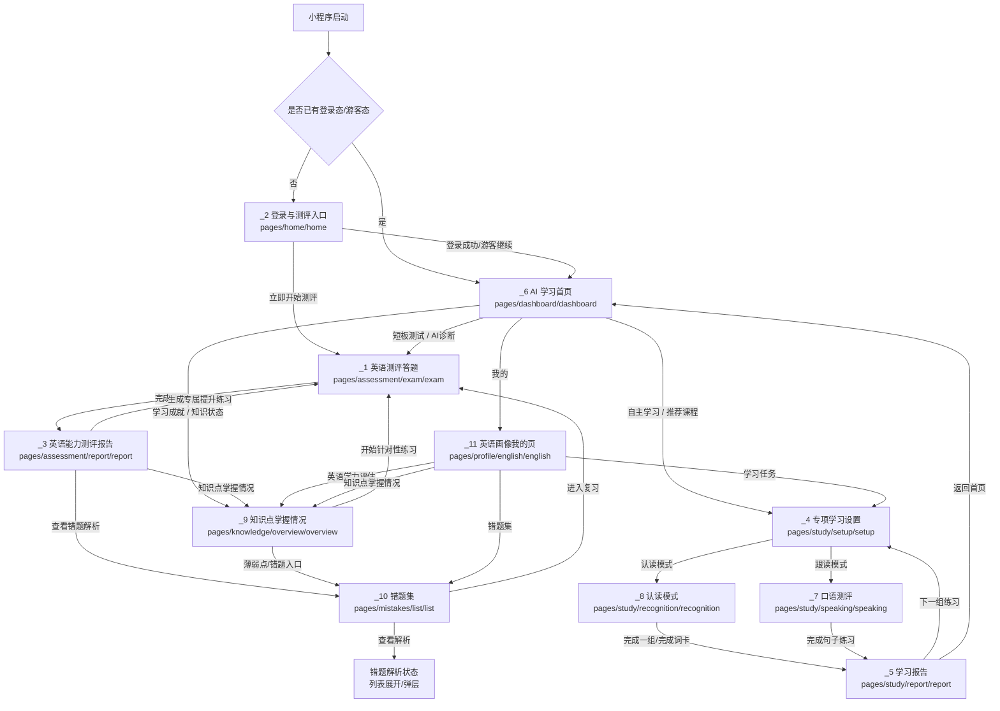
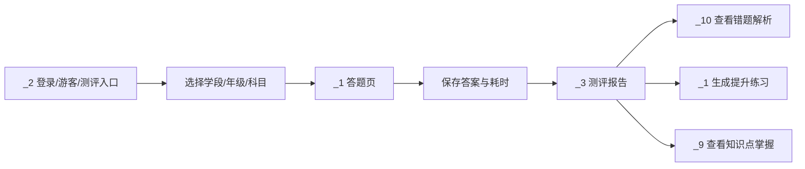
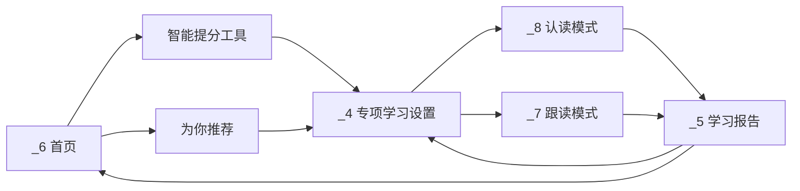
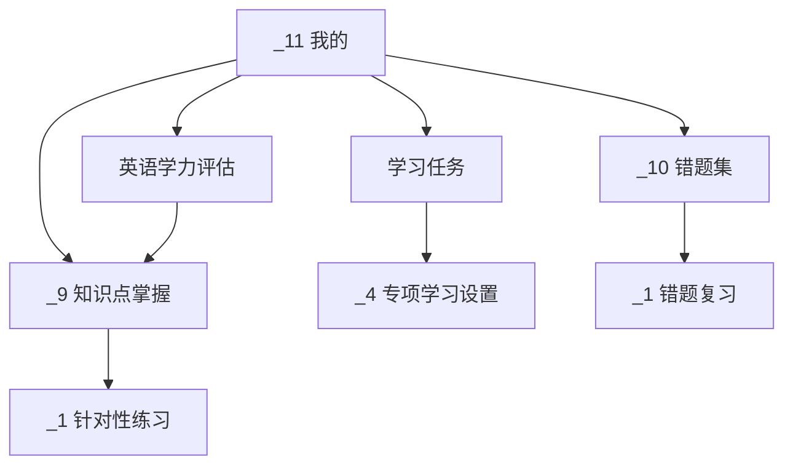

# Stitch AI 信息架构与页面关系图

本文档基于 `/data/project/ai-study/原型/stitch_ai` 当前保留的 11 个原型页面梳理，用于指导微信小程序前端页面串联。当前 `pages/home/home` 已实现的是 `_2` 登录与测评入口；登录后的真正“首页”应对应 `_6` AI 学习首页；“我的”以 `_11` 英语画像页为准。

## 1. 总体结论

Stitch AI 当前由 11 个有效原型组成，不是孤立页面，而是 5 个业务域：

- 入口与测评：`_2 -> _1 -> _3`
- 登录后首页：`_6`
- 专项学习：`_6/_11 -> _4 -> _8/_7 -> _5`
- 知识与错题：`_3/_6/_9/_11 -> _9/_10`
- 我的与学习任务：`_11 -> _4/_9/_10`

页面路径建议：

| 原型 | 页面名称 | 建议路由 | 业务域 |
| --- | --- | --- | --- |
| `_2` | 登录与测评入口 | `pages/home/home` | 入口与测评 |
| `_6` | AI 学习首页 | `pages/dashboard/dashboard` | 首页 |
| `_1` | 英语测评答题 | `pages/assessment/exam/exam` | 测评 |
| `_3` | 英语能力测评报告 | `pages/assessment/report/report` | 测评报告 |
| `_4` | 专项学习设置 | `pages/study/setup/setup` | 学习 |
| `_8` | 认读模式 | `pages/study/recognition/recognition` | 学习 |
| `_7` | 口语跟读测评 | `pages/study/speaking/speaking` | 学习 |
| `_5` | 学习报告 | `pages/study/report/report` | 学习报告 |
| `_9` | 知识点掌握情况 | `pages/knowledge/overview/overview` | 知识 |
| `_10` | 错题集 | `pages/mistakes/list/list` | 错题 |
| `_11` | 英语画像我的页 | `pages/profile/english/english` | 我的 |

## 2. 应用级架构图



## 3. 主导航结构

登录前：

```text
pages/home/home
  ├─ 登录
  ├─ 游客继续
  └─ 立即开始测评
```

登录后：

```text
底部导航
  ├─ 首页：_6 AI 学习首页
  ├─ 学习：_4 专项学习设置，继续进入 _8 / _7 / _5
  ├─ 知识：_9 知识点掌握情况，关联 _10 错题集
  └─ 我的：_11 英语画像我的页
```

实现建议：

- `pages/home/home` 保持为登录/游客/测评入口，不再承载登录后的首页。
- 新增 `pages/dashboard/dashboard` 作为底部导航“首页”。
- 登录成功或游客继续后写入本地态，再跳到 `dashboard`。
- 如果用户直接点 `_2` 的“立即开始测评”，允许不进入 `dashboard`，直接进入 `_1`。
- 底部“我的”统一进入 `_11`，不再规划额外我的页。

## 4. 页面与模块关系

### `_2` 登录与测评入口

模块：

- 顶部品牌栏：AI 学习助手、通知。
- 登录卡片：手机号、短信验证码、获取验证码、登录、游客继续。
- 测评选择：学段、年级、测评科目。
- 测评说明：15 道精选题目，预计 20 分钟。
- 底部主按钮：立即开始测评。

关系：

- 登录成功 -> `_6` AI 学习首页。
- 游客继续 -> `_6` AI 学习首页，身份标记为 guest。
- 立即开始测评 -> `_1` 英语测评答题，携带学段、年级、科目。
- 通知 -> 当前阶段 toast 或后续通知列表。

### `_6` AI 学习首页

模块：

- 顶部栏：AI 学习助手、搜索、通知。
- 问候与在线状态：早安、小明同学、在线。
- 今日学习成就：75%、剩余任务、基础巩固/查漏补缺/冲刺提升。
- 智能提分工具：短板测试、拍照录入、自主学习、在线答疑。
- 推荐内容：数学解析几何、英语完型填空。
- AI 助教入口：去提问。
- 底部导航：首页、我的。

关系：

- 这是登录后的主首页。
- 短板测试 -> `_1` 英语测评答题或后续通用测评。
- 拍照录入 -> 前端阶段 toast；后续可生成错题并进入 `_10`。
- 自主学习 -> `_4` 专项学习设置。
- 在线答疑/去提问 -> 前端阶段 toast 或后续答疑页。
- 推荐卡 -> `_4`，预选对应科目/单元/任务。
- 我的 -> `_11` 英语画像我的页。

### `_1` 英语测评答题

模块：

- 顶部栏：返回、英语测评、倒计时。
- 进度：当前第 1/20 题、练习类型、进度条。
- 题型：单选题、填空题、判断题。
- AI 监测提示：智能助教正在监测作答进度。
- 底部操作：上一题、下一题。

关系：

- 来源：`_2` 立即开始测评、`_6` 短板测试、`_9` 开始针对性练习、`_10` 进入复习、`_3` 生成提升练习。
- 下一题保存当前答案并推进题号。
- 最后一题的下一题变为“提交/完成测评”。
- 完成测评 -> `_3` 英语能力测评报告。

### `_3` 英语能力测评报告

模块：

- 顶部栏：报告标题、通知。
- 分数卡：85 总分、优秀、超越 92%。
- 结果统计：正确 17 题、错误 3 题。
- 知识点掌握：词汇语法、阅读理解、逻辑推理。
- 专家建议表单：姓名、联系电话、提交并咨询。
- 行动按钮：查看错题解析、生成专属提升练习。

关系：

- 来源：`_1` 完成测评。
- 查看错题解析 -> `_10` 错题集，按本次测评过滤。
- 生成专属提升练习 -> `_1`，使用薄弱知识点生成练习题。
- 知识点掌握卡可跳 `_9`。
- 提交并咨询当前阶段做表单校验和 toast，后端阶段再接咨询接口。

### `_4` 专项学习设置

模块：

- 顶部栏：智学AI、个人入口。
- 选择年级：初中、小学、高中。
- 选择科目：英语。
- 选择单元/章节：Unit 1、Unit 2、Unit 3。
- 选择学习模式：认读模式、跟读模式。
- 开始学习。
- 底部导航：首页、我的。

关系：

- 来源：`_6` 自主学习、推荐卡，`_11` 学习任务。
- 开始学习 + 认读模式 -> `_8`。
- 开始学习 + 跟读模式 -> `_7`。
- 首页 -> `_6`。
- 我的 -> `_11`。

### `_8` 认读模式

模块：

- 顶部栏：返回、认读模式、更多。
- 学习进度：5/20。
- 单词卡：Friendship、音标、播放。
- 词义：友谊、词性说明。
- 学习辅助：音标课程、词组库。
- 反馈按钮：模糊/不确定、认识。
- 记忆状态：上次记忆、掌握度。

关系：

- 来源：`_4` 选择认读模式。
- 播放 -> 前端阶段 toast 或模拟播放状态。
- 模糊/不确定 -> 降低或保持掌握度，进入下一词。
- 认识 -> 提升掌握度，进入下一词。
- 完成 20 个词 -> `_5` 学习报告；也可支持继续下一组。

### `_7` 口语测评

模块：

- 顶部栏：返回、口语测评、更多。
- 进度：第 3/10 句。
- 标准范读与句子：A friend in need is a friend indeed.
- 中文释义：患难见真情。
- 得分与反馈：95 分、非常流利。
- AI 学习建议：针对 need 长元音。
- 录音操作：重录、长按话筒、下一题。
- 底部导航：首页、学习、复习、我的。

关系：

- 来源：`_4` 选择跟读模式。
- 标准范读 -> 模拟播放状态。
- 长按话筒 -> 录音中状态；松开 -> 生成模拟分数和建议。
- 重录 -> 清空当前句结果。
- 下一题 -> 推进句子；完成 10 句 -> `_5` 学习报告。
- 复习 -> `_10` 或当前练习错句列表，前端阶段可先跳 `_10`。
- 我的 -> `_11`。

### `_5` 学习报告

模块：

- 顶部栏：返回、学习报告、分享。
- 总分环：92 分、优 Excellent、总体评价。
- 指标：正确率、学习时长、练习句数。
- 一键播放所有录音。
- 练习详情：句子、分数、反馈、单句播放。
- 底部操作：返回首页、下一组练习。

关系：

- 来源：`_7` 跟读完成，`_8` 认读完成也可复用。
- 一键播放/单句播放 -> 前端阶段模拟播放状态。
- 返回首页 -> `_6`。
- 下一组练习 -> `_4`，保留年级/科目，切换下一单元或下一任务。

### `_9` 知识点掌握情况

模块：

- 顶部栏：返回、分享、设置。
- 综合评估：85 分、超越 92%。
- 核心能力：词汇、语法、口语表达。
- 分项技能：听力理解、阅读能力、写作表达。
- AI 学习洞察：长难句、定语从句、口语模考、Unit 4-6。
- 行动按钮：开始针对性练习。
- 更新提示：知识图谱正在持续更新中。
- 底部导航：首页、学习、知识、我的。

关系：

- 来源：`_3` 报告、`_6` 学习成就、`_11` 知识点掌握。
- 开始针对性练习 -> `_1`，携带薄弱点生成题集；也可进入 `_4` 做学习任务。
- 底部学习 -> `_4`。
- 底部我的 -> `_11`。
- 错题或薄弱点详情 -> `_10`。

### `_10` 错题集

模块：

- 顶部栏：返回、错题集、筛选。
- 统计：累计错题、待复习、已掌握、总体掌握进度。
- 分类筛选：生字词、重点句子、每日一题、其他。
- 搜索：搜索错题。
- 错题列表：高频错误、重点复习、数学计算。
- 导师提示：2 位导师提供了解答。
- 底部操作：进入复习。
- 底部导航：首页、学习、知识、我的。

关系：

- 来源：`_3` 查看错题解析、`_9` 薄弱点、`_11` 错题集入口。
- 分类和搜索只影响当前列表。
- 查看解析 -> 当前阶段在列表内展开解析或弹层，不单独新增页面。
- 进入复习 -> `_1`，使用错题生成复习题集。
- 学习 -> `_4`，知识 -> `_9`，我的 -> `_11`。

### `_11` 英语画像我的页

模块：

- 顶部栏：智学AI、通知、设置。
- 用户资料：头像、陈小智、English Star、Advanced Learner、高二年级。
- 英语学力评估：最近模考 138/150，+12%。
- 学习任务：已完成 8/12。
- 知识点掌握情况：词汇 85%、语法 62%、口语 45%。
- 错题集：Question Bank，88 道待回顾。
- 底部导航：首页、我的。

关系：

- 这是当前版本默认“我的”页。
- 英语学力评估 -> `_9`，预选英语维度。
- 学习任务 -> `_4`，预选英语。
- 知识点掌握情况 -> `_9`。
- 错题集 -> `_10`，预选英语错题。
- 首页 -> `_6`。

## 5. 核心业务流图

### 5.1 登录到测评报告



### 5.2 首页到学习闭环



### 5.3 我的到任务、知识、错题



## 6. 底部导航归属

| 导航项 | 目标页面 | 涉及原型 |
| --- | --- | --- |
| 首页 | `_6` AI 学习首页 | `_6`、`_9`、`_10`、`_11` |
| 学习 | `_4` 专项学习设置 | `_7`、`_9`、`_10` |
| 知识 | `_9` 知识点掌握情况 | `_9`、`_10` |
| 我的 | `_11` 英语画像我的页 | `_4`、`_6`、`_7`、`_9`、`_10`、`_11` |

特殊处理：

- `_2` 登录页底部导航在 HTML 中是隐藏状态，前端实现中不要作为主导航显示。
- `_1` 测评页和 `_3` 报告页不放主底部导航，保留任务流沉浸感。
- `_5` 学习报告使用页面内按钮返回首页或下一组，不强制展示底部导航。

## 7. 本地状态模型

前端阶段不接后端，建议用本地状态把页面串起来：

```text
session
  ├─ isLoggedIn
  ├─ isGuest
  └─ profileId

learningContext
  ├─ gradeStage
  ├─ grade
  ├─ subject
  ├─ unit
  └─ mode: recognition | speaking

assessmentSession
  ├─ source: entry | weakness | knowledge | mistake | report
  ├─ questionSetId
  ├─ answers
  ├─ elapsedSeconds
  └─ reportId

knowledgeState
  ├─ totalScore
  ├─ abilities
  ├─ weakPoints
  └─ recommendations

mistakeState
  ├─ category
  ├─ keyword
  ├─ selectedMistakeIds
  └─ reviewQuestionSetId

taskState
  ├─ pendingTasks
  ├─ completedTasks
  └─ selectedTaskId
```

状态落点：

- `_2` 写入 `session`、`learningContext`。
- `_1` 读写 `assessmentSession`。
- `_3` 读取 `assessmentSession`，生成或读取 `knowledgeState`、`mistakeState`。
- `_4/_8/_7/_5` 读写 `learningContext` 和 `taskState`。
- `_9` 读取 `knowledgeState`。
- `_10` 读取 `mistakeState`。
- `_11` 汇总 `profile`、`taskState`、`knowledgeState`、`mistakeState`。

## 8. 开发落地顺序

按页面关系，推荐顺序调整为：

1. 保留 `_2`：把登录/游客继续接到 `_6`，把立即开始测评接到 `_1`。
2. 先做 `_6`：建立登录后首页和主导航落点。
3. 做测评闭环：`_1 -> _3 -> _10/_9/_1`。
4. 做学习闭环：`_4 -> _8/_7 -> _5`。
5. 做知识错题闭环：`_9 <-> _10`，并接入 `_3/_6/_11`。
6. 做我的闭环：`_11 -> _4/_9/_10`。
7. 最后统一底部导航、返回逻辑和本地状态。

## 9. 验收路径

最少需要跑通这些完整链路：

```text
链路 A：登录 -> 首页
_2 登录/游客继续 -> _6

链路 B：登录 -> 测评 -> 报告 -> 错题
_2 -> _1 -> _3 -> _10

链路 C：首页 -> 学习 -> 跟读 -> 学习报告
_6 -> _4 -> _7 -> _5

链路 D：首页 -> 学习 -> 认读 -> 学习报告
_6 -> _4 -> _8 -> _5

链路 E：我的 -> 学习任务
_11 -> _4 -> _8/_7

链路 F：我的 -> 知识 -> 针对性练习
_11 -> _9 -> _1 -> _3

链路 G：我的 -> 错题 -> 复习
_11 -> _10 -> _1 -> _3
```

## 10. 本次梳理记录

Run ID: `20260517-architecture-cleanup`

已完成：

- 按当前有效原型重新整理 11 个页面的信息架构。
- 删除多余原型目录。
- 将底部“我的”和所有个人中心入口统一到 `_11` 英语画像我的页。
- 将学习任务、知识点掌握、错题集入口统一为 `_11 -> _4/_9/_10`。
